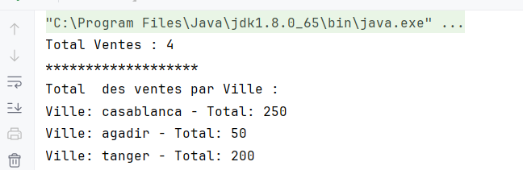
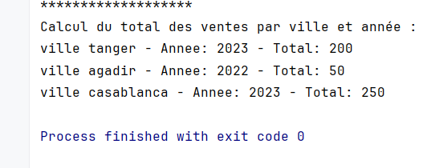
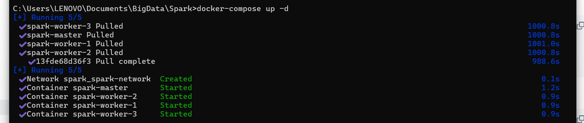
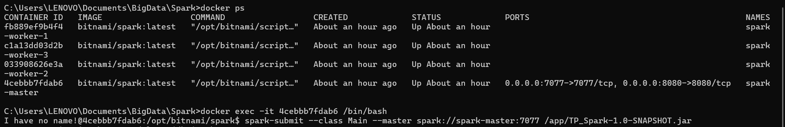

# TP: Traitement parallèle et distribué avec Spark

Exercice 1 :
1. On souhaite développer une application Spark permettant, à partir d’un
   fichier texte (ventes.txt) en entré, contenant les ventes d’une entreprise dans
   les différentes villes, de déterminer le total des ventes par ville. La structure
   du fichier ventes.txt est de la forme suivante :
   date ville produit prix

   - Compte du nombre total de ventes
   

   - Calcul du total des ventes par ville
   

   - Calcul du total des ventes par ville et année
   

Exécution sur un cluster Spark (via Docker)

    - Lancer le cluster

   - Executer le script

